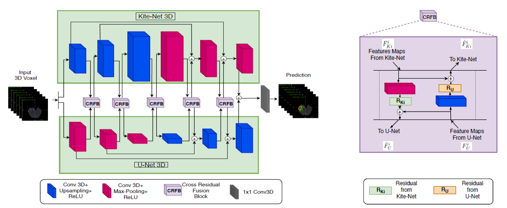

# Liver and tumor segmentation - KiU-Net

Adaptation and improvement of the existing neural network KiU-Net from the conference paper: [KiU-Net: Towards Accurate Segmentation of Biomedical Images using Over-complete Representations](https://arxiv.org/abs/2006.04878) by Jeya Maria Jose Valanarasu, Vishwanath A. Sindagi, Ilker Hacihaliloglu and Vishal M. Patel (2021). The repository where we get the code can be found [here](https://github.com/jeya-maria-jose/KiU-Net-pytorch).

The task to solve for this architecture is to segment from medical CT-contrast-enhaced scans from the public dataset [LiTS challenge](https://competitions.codalab.org/competitions/17094) the liver and tumor separately.

## Architecture overview

The "traditional" encoder-decoder networks such as U-Net architecture has been widely used for segmentation tasks, but it focuses more on high-level features rather than low-level features, which are important for detecting small structures like lesions. This can be problematic as the receptive field increases with depth in the decoder.

To address this issue, a KiU-Net 3D architecture with two branches is proposed. The first branch, called Kite-Net, is an overcomplete convolutional network that captures fine details and accurate edges of the input. The input image is projected into a higher dimension to constrain the receptive field from increasing in the deeper layers of the network. The second branch, U-Net, learns high-level features and projects the input image into a lower dimension, allowing the receptive field size of the filters to increase with depth, enabling it to extract high-level features in the deeper layers.

To combine the features of the two networks and further exploit their capacity, they introduce a novel cross residual feature block (CRFB) at each level in the encoder and decoder of KiU-Net 3D. This block combines the respective features at multiple scales to improve network performance.

Overall, KiU-Net 3D is a 3D convolutional architecture designed for volumetric segmentation tasks that addresses the challenges of detecting small structures in the image.

## KiU-Net-pytorch folder

In the folder named KiU-Net-pytorch, you can find the complete architecture code for the proposed task. However, the original code was designed for a binary segmentation task, which only differentiated between the background and the liver/tumor. To perform a more complex multi-class segmentation task, we made significant changes to the code. For further details on the modifications we made, please refer to the README.md file in this folder.

## Results folder

The _Results_ folder contains the dice scores for the segmentation task using different architectures, including ResUNet, UNet, SegNet, KiUNetmin, and KiUNet. The results are organized into two folders: binary segmentation and multi-class segmentation.

In the binary segmentation folder, we followed the same approach as in the original code, where the liver and tumor labels are combined into a single value, and the task is to segment the background vs. the liver/tumor.

In the multi-class segmentation folder, the task is more complex, with a segmentation of the background vs. liver vs. tumor for the corresponding architecture.

For more detailed information about the results and how they were obtained, please refer to the README.md file in this folder.

## KiUNet.iynb

The following code provides an in-depth analysis of various datasets such as LiTS, Medical Segmentation Decathlon, and 3D-IRCADb-01 for the segmentation task. For each patient in both the training and test sets, we detect and count the labels for the background, liver, and tumor, as well as the number of patients that do not have tumors segmented in their masks. We also identify slices where the liver or tumor is located for each direction, unique labels, and the maximum and minimum slice difference for tumor and liver segmentation to analyze their size. In addition, we provide visualizations of the slice difference and the CT scan. Moreover, the code includes training and testing for different architectures, along with visualization of the loss function.

## References

KiU-Net: Overcomplete Convolutional Architectures for Biomedical Image and Volumetric Segmentation. Jeya Maria Jose Valanarasu, Vishwanath A. Sindagi, Ilker Hacihaliloglu and Vishal M. Patel (2021). IEEE Transactions on Medical Imaging, vol. 40, no. 5, pp. 1425-1437, May 2021, doi: 10.1109/TMI.2021.3068556.
