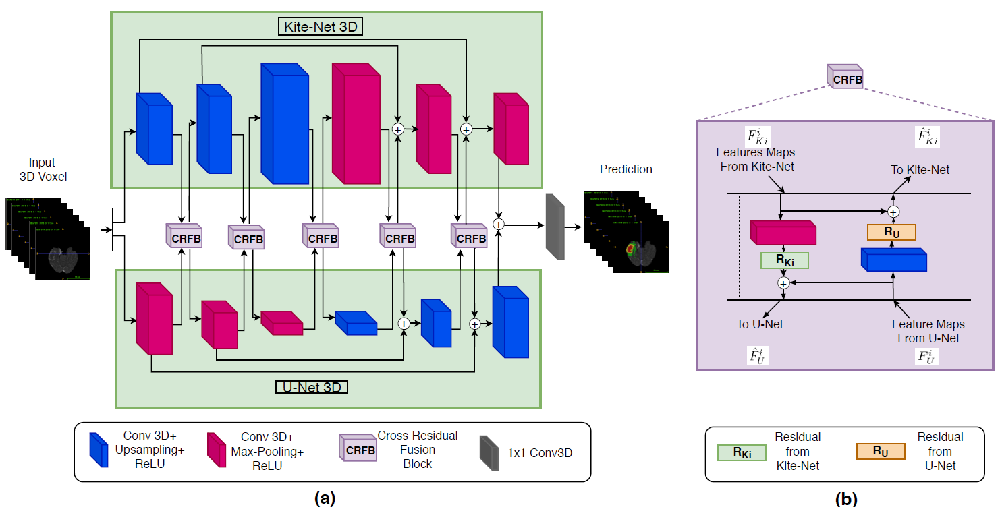

# Liver and tumor segmentation - KiU-Net

This part of the project aims to enhance the neural network architecture known as KiU-Net, as described in the paper [KiU-Net: Towards Accurate Segmentation of Biomedical Images using Over-complete Representations](https://arxiv.org/abs/2006.04878) by Jeya Maria Jose Valanarasu, Vishwanath A. Sindagi, Ilker Hacihaliloglu, and Vishal M. Patel. Specifically, we will adapt and improve the existing code available in the repository linked [here](https://github.com/jeya-maria-jose/KiU-Net-pytorch).

The task is to use KiU-Net to segment the liver and tumor from medical CT-contrast-enhanced scans, using the public dataset provided by the[ LiTS challenge](https://competitions.codalab.org/competitions/17094). This is a challenging problem with many potential applications in medical imaging, and we believe that the modifications to KiU-Net will enable more accurate and efficient segmentation of these important structures.

## Architecture overview

The "traditional" encoder-decoder networks such as U-Net architecture has been widely used for segmentation tasks, but it focuses more on high-level features rather than low-level features, which are important for detecting small structures like lesions. This can be problematic as the receptive field increases with depth in the decoder.

To address this issue, a KiU-Net 3D architecture with two branches is proposed. The first branch, called Kite-Net 3D, is an overcomplete convolutional network that captures fine details and accurate edges of the input (low-level features). The input image is projected into a higher dimension to constrain the receptive field from increasing in the deeper layers of the network. The second branch, U-Net, learns high-level features and projects the input image into a lower dimension, allowing the receptive field size of the filters to increase with depth, enabling it to extract high-level features in the deeper layers.

To combine the features of the two networks and further exploit their capacity, they introduce a novel cross residual feature block (CRFB) at each level in the encoder and decoder of KiU-Net 3D. This block combines the respective features at multiple scales to improve network performance.

Overall, KiU-Net 3D is a convolutional architecture designed for volumetric segmentation tasks that addresses the challenges of detecting either tiny or bigger structures in the image.

## KiU-Net-pytorch folder

The [KiU-Net-pytorch](https://gitlab.lrz.de/computational-surgineering/liver_vessel_segm/-/tree/Pascual/Liver%20and%20tumor/KiU-Net/KiU-Net-pytorch) folder contains the complete architecture code for our proposed task of segmenting the liver and tumor from medical CT-contrast-enhanced scans. However, the original code was designed for a binary segmentation task that only differentiated between the background and the liver/tumor.

In order to adapt the code to our more complex multi-class segmentation task, we made significant changes to the architecture. These modifications are described in detail in the [README.md](https://gitlab.lrz.de/computational-surgineering/liver_vessel_segm/-/blob/Pascual/Liver%20and%20tumor/KiU-Net/KiU-Net-pytorch/README.md) file located in the [KiU-Net-pytorch](https://gitlab.lrz.de/computational-surgineering/liver_vessel_segm/-/tree/Pascual/Liver%20and%20tumor/KiU-Net/KiU-Net-pytorch) folder. Please refer to this file for a comprehensive overview of the changes we made to the original code, which we believe will improve the accuracy and efficiency of our segmentation task.

## Results folder

The [Results](https://gitlab.lrz.de/computational-surgineering/liver_vessel_segm/-/tree/Pascual/Liver%20and%20tumor/KiU-Net/Results) folder contains the dice scores for the segmentation task using different architectures, including ResUNet, UNet, SegNet, KiUNetmin, and KiUNet. The results are organized into two folders: binary segmentation and multi-class segmentation.

- In the [Binary segmentation](https://gitlab.lrz.de/computational-surgineering/liver_vessel_segm/-/tree/Pascual/Liver%20and%20tumor/KiU-Net/Results/Binary%20segmentation/1_KiUNet_LiTS_TverskyLoss) folder, we followed the same approach as in the original code, where the liver and tumor labels are combined into a single value (1), and the task is to segment the background (0) vs. the liver/tumor (1).
- In the [Multi-class segmentation](https://gitlab.lrz.de/computational-surgineering/liver_vessel_segm/-/tree/Pascual/Liver%20and%20tumor/KiU-Net/Results/Multi-class%20segmentation) folder, the task is more complex, with a segmentation of the background vs. liver vs. tumor for the corresponding architecture.

For more detailed information about the results and how they were obtained, please refer to the [README.md](https://gitlab.lrz.de/computational-surgineering/liver_vessel_segm/-/blob/Pascual/Liver%20and%20tumor/KiU-Net/Results/README.md) file in this folder.

## KiUNet.iynb

Our code provides a comprehensive analysis of several datasets commonly used for the segmentation task, including LiTS, Medical Segmentation Decathlon, and 3D-IRCADb-01. For each patient in both the training and test sets, we perform label detection and counting for the background, liver, and tumor, as well as identify patients whose masks do not contain segmented tumors. We also analyze the size of the liver and tumor by identifying the slices where they are located in each direction, unique labels, and the maximum and minimum slice differences for segmentation.

To further aid in our analysis, we provide visualizations of the slice difference and the CT scan. Additionally, our code includes training and testing for various architectures, and visualizations of the loss function to aid in model selection and optimization.

Overall, our code provides a comprehensive and detailed analysis of these datasets, which we hope will be useful for researchers and practitioners working on medical image segmentation tasks.

## References

KiU-Net: Overcomplete Convolutional Architectures for Biomedical Image and Volumetric Segmentation. Jeya Maria Jose Valanarasu, Vishwanath A. Sindagi, Ilker Hacihaliloglu and Vishal M. Patel (2021). IEEE Transactions on Medical Imaging, vol. 40, no. 5, pp. 1425-1437, May 2021, doi: 10.1109/TMI.2021.3068556.
