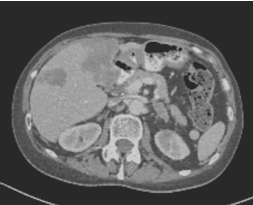
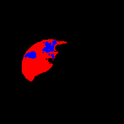
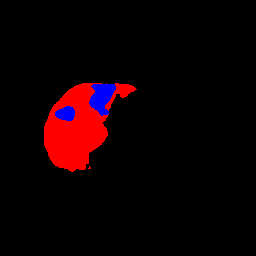

## Results

This folder contains subfolders for binary and multi-class segmentation tasks, each containing further subfolders for different architecture and loss combinations used to obtain corresponding results.

Each subfolder for both tasks contains the following items:

- A file named _Summary.txt_, which displays the neural network utilized and its respective hyperparameters.
- Patient-wise predictions for the test dataset saved in .nii format.
- An .xlsx file named _results.xlsx_ which contains the Dice score for each patient in the test dataset, calculated per class label and globally. This file also includes the mean, standard deviation, minimum, and maximum Dice score per class label.

For the [multi-class segmentation](https://gitlab.lrz.de/computational-surgineering/liver_vessel_segm/-/tree/Pascual/Liver%20and%20tumor/KiU-Net/Results/Multi-class%20segmentation) task, two additional subfolders exist, namely [Cross-validation](https://gitlab.lrz.de/computational-surgineering/liver_vessel_segm/-/tree/Pascual/Liver%20and%20tumor/KiU-Net/Results/Multi-class%20segmentation/8_CrossValidation_KiUNet_LiTS_CrossEntropyLoss) and [Ablation study](https://gitlab.lrz.de/computational-surgineering/liver_vessel_segm/-/tree/Pascual/Liver%20and%20tumor/KiU-Net/Results/Multi-class%20segmentation/9_AblationStudy_KiUNet_LiTS_CrossEntropyLoss) using KiU-Net architecture. These subfolders use different configurations of train and test sets as follows:

- In the [Cross-validation](https://gitlab.lrz.de/computational-surgineering/liver_vessel_segm/-/tree/Pascual/Liver%20and%20tumor/KiU-Net/Results/Multi-class%20segmentation/8_CrossValidation_KiUNet_LiTS_CrossEntropyLoss) subfolder, we have used a 5-fold cross-validation technique. Here, the KiU-Net model was trained and evaluated five times, each time with a different test set. This is a summary of the segmentation results (Dice score) obtained:

| Folding |  Liver  | Tumor  |
| ------- | ------  | ------ |
|    1    |  88.25% | 33.44% |
|    2    |  82.56% | 32.87% |
|    3    |  83.68% | 27.40% |
|    4    |  90.68% | 37.62% |
|    5    |  89.83% | 36.82% |

- In the [Ablation study](https://gitlab.lrz.de/computational-surgineering/liver_vessel_segm/-/tree/Pascual/Liver%20and%20tumor/KiU-Net/Results/Multi-class%20segmentation/9_AblationStudy_KiUNet_LiTS_CrossEntropyLoss) subfolder, we divided the dataset into two subsets (big and small tumor) based on the number of tumor labels: [high tumor label representation](https://gitlab.lrz.de/computational-surgineering/liver_vessel_segm/-/tree/Pascual/Liver%20and%20tumor/KiU-Net/Results/Multi-class%20segmentation/9_AblationStudy_KiUNet_LiTS_CrossEntropyLoss/High%20tumor%20representation) (> 7000 tumor labels in a patient) and [low tumor label representation](https://gitlab.lrz.de/computational-surgineering/liver_vessel_segm/-/tree/Pascual/Liver%20and%20tumor/KiU-Net/Results/Multi-class%20segmentation/9_AblationStudy_KiUNet_LiTS_CrossEntropyLoss/Low%20tumor%20representation) (< 7000 tumor labels in a patient). We obtained 56 and 62 patients, respectively, and discarded 13 patients that did not have tumor segmentation in the ground truth mask. We then divided each subset into train and test sets and ran the KiU-Net model, achieving better results for the high tumor label representation dataset than the other. Additionally, we apply data augmentation to those two datasets (horizontal flip, random rotation and affine transformation) to increase the number of training samples. This is a summary of the segmentation results (Dice score) obtained:

|   Dataset     |  Liver  | Tumor  |
| ------------- | ------  | ------ |
|  Big tumor    |  84.97% | 65.55% |
|  Small tumor  |  88.28% | 23.02% |

Here, there's an example of the patient 27 of the CT scan, the ground truth mask and the segmentation by KiU-Net:
<table>
  <tr>
    <th>CT scan</th>
    <th>Ground truth</th>
    <th>Prediction</th>
  </tr>
  <tr>
    <td></td>
    <td></td>
    <td></td>
  </tr>
</table>

